# EXP-1-Image-Handling-and-Pixel-Transformations-Using-OpenCV

## AIM:

Write a Python program using OpenCV that performs the following tasks:

1. Read and Display an Image.
2. Draw shapes and text on the image (line, circle, rectangle and text).
3. Convert the image between different color spaces (RGB, HSV, Grayscale and YCrCb).
4. Modify the pixels of the image.
5. Resize, crop and flip the image.
6. Save the final modified image.

## Software Required:

- Anaconda - Python 3.7
- Jupyter Notebook (for interactive development and execution)

## Algorithm:

### Step 1:

Load an image from your local directory and display it.

### Step 2:

Draw a line from the top-left to the bottom-right of the image, a circle at the center of the image, a rectangle around the whole image and add the text "OpenCV Drawing" at the top-left corner of the image.

### Step 3:

Convert the image from RGB to HSV, RGB to GRAY and RGB to YCrCb, then convert the HSV image back to RGB and display each of them.

### Step 4:

Modify a block of pixels (300x300) of the image to white, starting from (200, 200).

### Step 5:

Resize the original image to half its size and display it.

### Step 6:

Crop a region of interest (ROI) from the image (a 300x300 pixel area starting at (50, 50)) and display it.

### Step 7:

Flip the original image horizontally and vertically and display both.

### Step 8:

Save the final modified image to your local directory.

## Program Developed By:

- **Name:** Mitran R
- **Register Number:** 212224040192

### Ex. No. 01

## import packages

```python
import cv2
import matplotlib.pyplot as plt
```

## 1. Reading and Displaying the Input Image

### Code

```python
img = cv2.imread('1.jpg', cv2.IMREAD_COLOR)
# Convert BGR (OpenCV's default) to RGB (Matplotlib's expected color order)
img_rgb = cv2.cvtColor(img, cv2.COLOR_BGR2RGB)
# Display the image using Matplotlib
plt.imshow(img_rgb, cmap='viridis')  # You can change 'viridis' to another cmap or use None for RGB images
plt.title("Original Image")
plt.axis('off')  # Removes axis ticks and labels
plt.show()
```

### Output

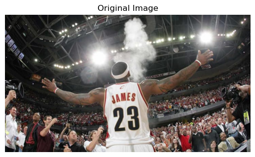

## 2. Drawing Shapes and Text on the Image

### 2.1 Drawing a Line (top-left to bottom-right)

#### Code

```python
# Load the image
image = cv2.imread('1.jpg')

# Convert BGR (OpenCV's default) to RGB (Matplotlib's expected color order)
img_rgb = cv2.cvtColor(img, cv2.COLOR_BGR2RGB)

# Draw a line from top-left to bottom-right
line_img = cv2.line(img_rgb, (0, 0), (768, 600), (255, 0, 0), 2)  # cv2.line(image, start_point, end_point, color, thickness)

plt.imshow(line_img, cmap='viridis')
plt.title("Image with Line")
plt.axis('off')
plt.show()
```

#### Output

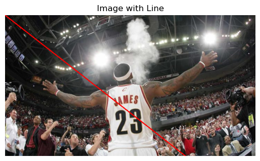

### 2.2 Drawing a Circle at the Center

#### Code

```python
# Load the image
image = cv2.imread('1.jpg')

# Convert BGR (OpenCV's default) to RGB (Matplotlib's expected color order)
img_rgb = cv2.cvtColor(img, cv2.COLOR_BGR2RGB)

circle_img = cv2.circle(img_rgb, (400, 300), 150, (255, 0, 0), 10)  # cv2.circle(image, center, radius, color, thickness)

plt.imshow(circle_img, cmap='viridis')
plt.title("Image with Circle")
plt.axis('off')
plt.show()
```

#### Output

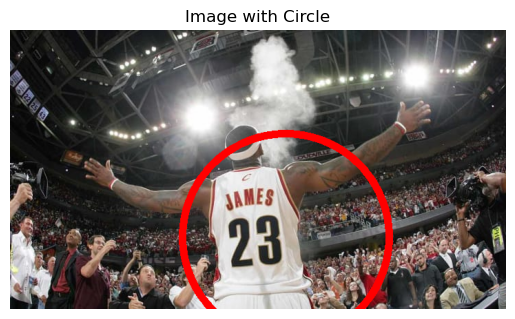

### 2.3 Drawing a Rectangle Around the Whole Image

#### Code

```python
# Load the image
image = cv2.imread('1.jpg')

# Convert BGR (OpenCV's default) to RGB (Matplotlib's expected color order)
img_rgb = cv2.cvtColor(img, cv2.COLOR_BGR2RGB)

# Draw a rectangle around the whole image
rectangle_img = cv2.rectangle(img_rgb, (0, 0), (768, 600), (0, 0, 255), 10)  # cv2.rectangle(image, start_point, end_point, color, thickness)

plt.imshow(rectangle_img, cmap='viridis')
plt.title("Image with Rectangle")
plt.axis('off')
plt.show()
```

#### Output

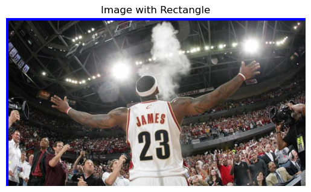

### 2.4 Adding Text to the Image

#### Code

```python
# Load the image
image = cv2.imread('1.jpg')

# Convert BGR (OpenCV's default) to RGB (Matplotlib's expected color order)
img_rgb = cv2.cvtColor(img, cv2.COLOR_BGR2RGB)

# Add text to the image
text_img = cv2.putText(img_rgb, "OpenCV Drawing", (10, 30), cv2.FONT_HERSHEY_SIMPLEX, 1, (255, 255, 255), 10)  ## cv2.putText(image, text, position, font, font_scale, color, thickness)

plt.imshow(text_img, cmap='viridis')
plt.title("Image with Text")
plt.axis('off')
plt.show()
```

#### Output

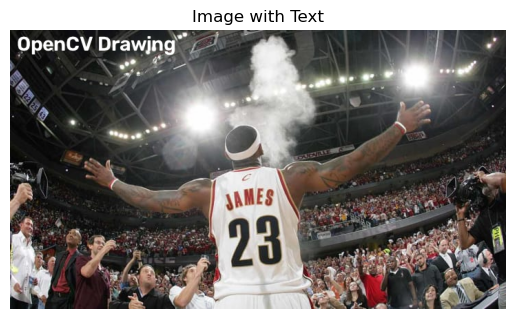

## 3. Color Space Conversions

### 3.1 Displaying the Original RGB Image

#### Code

```python
# Load the image
image = cv2.imread('1.jpg')

image_rgb = cv2.cvtColor(image, cv2.COLOR_BGR2RGB)

# Original RGB Image
plt.imshow(image_rgb)
plt.title("Original RGB Image")
plt.axis("off")
```

#### Output


### 3.2 Displaying the HSV Image

#### Code

```python
# Convert RGB to HSV
image_hsv = cv2.cvtColor(image_rgb, cv2.COLOR_RGB2HSV)

# HSV Image
plt.imshow(image_hsv)
plt.title("HSV Image")
plt.axis("off")
```

#### Output

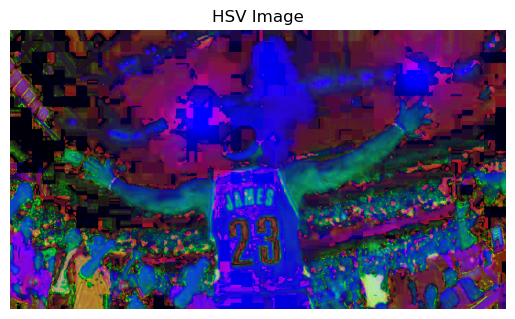

### 3.3 Displaying the Grayscale Image

#### Code

```python
# Convert RGB to GRAY
image_gray = cv2.cvtColor(image_rgb, cv2.COLOR_RGB2GRAY)

# Grayscale Image
plt.imshow(image_gray, cmap='gray')
plt.title("Grayscale Image")
plt.axis("off")
```

#### Output

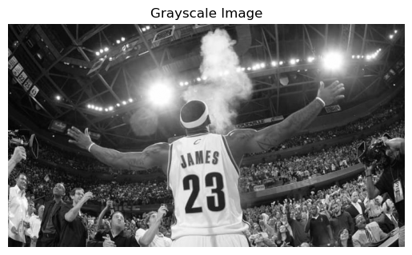

### 3.4 Displaying the YCrCb Image

#### Code

```python
# Convert RGB to YCrCb
image_ycrcb = cv2.cvtColor(image_rgb, cv2.COLOR_RGB2YCrCb)

# YCrCb Image
plt.imshow(image_ycrcb)
plt.title("YCrCb Image")
plt.axis("off")
```

#### Output

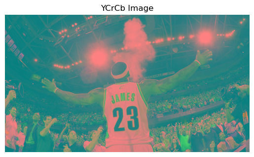

### 3.5 Converting the HSV Image back to RGB

#### Code

```python
# Convert HSV back to RGB
image_hsv_to_rgb = cv2.cvtColor(image_hsv, cv2.COLOR_HSV2RGB)

plt.imshow(image_hsv_to_rgb)
plt.title("HSV to RGB Image")
plt.axis("off")
```

#### Output


## 4. Modifying Pixels (White Block)

### Code

```python
# Load the image
image = cv2.imread('1.jpg')

# Modify a block of pixels (300x300) to white, starting from (200, 200)
image[200:500, 200:500] = [255, 255, 255]  # Rows: 200-499, Columns: 200-499

# Convert BGR to RGB for displaying with Matplotlib
image_rgb = cv2.cvtColor(image, cv2.COLOR_BGR2RGB)

# Display the modified image
plt.imshow(image_rgb)
plt.title("Image with 300x300 White Block")
plt.axis("off")
plt.show()
```

### Output

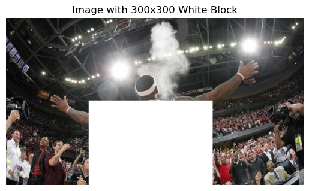

## 5. Resizing the Image to Half its Size

### Code

```python
# Load the image
image = cv2.imread('1.jpg')

# Resize the image to half its size
resized_image = cv2.resize(image, (768 // 2, 600 // 2))  # (new_width, new_height)

# Convert BGR to RGB for displaying with Matplotlib
resized_image_rgb = cv2.cvtColor(resized_image, cv2.COLOR_BGR2RGB)

# Display the resized image
plt.imshow(resized_image_rgb)
plt.title("Resized Image (Half Size)")
plt.axis("off")
plt.show()
```

### Output

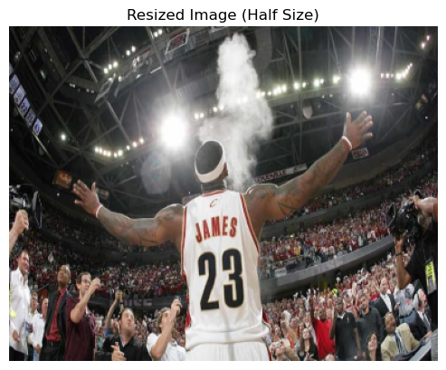

## 6. Cropping a Region of Interest (ROI)

### Code

```python
# Load the image
image = cv2.imread('1.jpg')

# Crop a 300x300 region starting from (50, 50)
roi = image[50:350, 50:350]  # Rows: 50-349, Columns: 50-349

# Convert BGR to RGB for displaying with Matplotlib
roi_rgb = cv2.cvtColor(roi, cv2.COLOR_BGR2RGB)

# Display the cropped region (ROI)
plt.imshow(roi_rgb)
plt.title("Cropped Region of Interest (ROI)")
plt.axis("off")
plt.show()
```

### Output

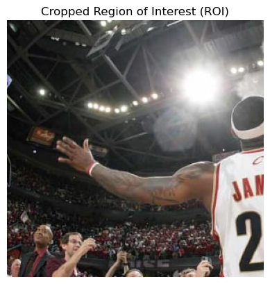

## 7. Flipping the Image

### 7.1 Flipping Horizontally

#### Code

```python
# Load the image
image = cv2.imread('1.jpg')

# Flip the image horizontally (left-right)
flipped_horizontally = cv2.flip(image, 1)

# Convert BGR to RGB for displaying with Matplotlib
flipped_horizontally_rgb = cv2.cvtColor(flipped_horizontally, cv2.COLOR_BGR2RGB)

# Horizontal flip
plt.imshow(flipped_horizontally_rgb)
plt.title("Flipped Horizontally")
plt.axis("off")
```

#### Output

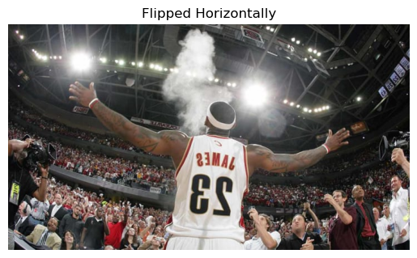

### 7.2 Flipping Vertically

#### Code

```python
# Load the image
image = cv2.imread('1.jpg')

# Flip the image vertically (up-down)
flipped_vertically = cv2.flip(image, 0)

# Convert BGR to RGB for displaying with Matplotlib
flipped_vertically_rgb = cv2.cvtColor(flipped_vertically, cv2.COLOR_BGR2RGB)

# Vertical flip
plt.imshow(flipped_vertically_rgb)
plt.title("Flipped Vertically")
plt.axis("off")
```

#### Output

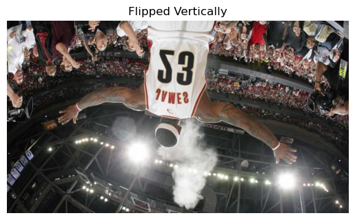

## 8. Saving the Final Modified Image

### Code

```python
# Load the image
image = cv2.imread('1.jpg')

# Save the final modified image to your local directory
cv2.imwrite('output.jpg', image)
print("Image saved successfully!")
```

# Result

Successfully performed basic image processing operations using OpenCV, including reading and displaying an image, drawing shapes and text, converting between color spaces (RGB, HSV, Grayscale and YCrCb), modifying pixels, resizing, cropping, flipping, and saving the final modified image.
